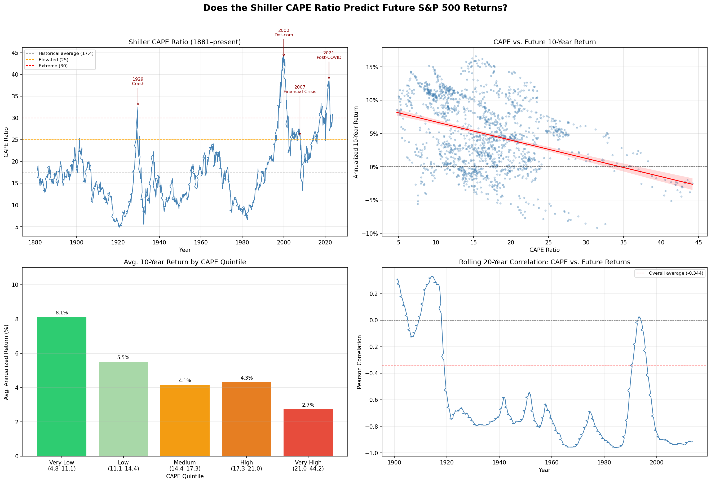

# shiller-cape-analysis
Testing whether the Shiller CAPE ratio predicts future S&amp;P 500 returns

# Shiller CAPE Analysis – Does Valuation Predict S&P 500 Returns?

This project tests a simple but important question: if you know how expensive the stock market is today, can you predict what returns will look like over the next 10 years?

To answer it, I used the Shiller CAPE ratio, a valuation measure developed by Nobel laureate Robert Shiller that compares stock prices to 10 years of inflation-adjusted earnings. The data goes back to 1881, which gives us enough history to actually test the idea properly.

---

## What I found

There is a clear negative relationship between CAPE and future 10-year returns. When the market has been cheap historically, returns over the following decade have been strong. When it has been expensive, returns have been weak.

The Pearson correlation came out at -0.344, which is statistically significant. CAPE alone explains about 12% of the variation in future returns — modest, but surprisingly powerful for a single number applied to something as complex as the stock market.

The predictive power also gets stronger the longer you extend the time horizon. At 1 year the correlation is -0.178, at 5 years it's -0.348, and at 10 years -0.344. CAPE is not a timing tool, it says little about what the market does next year. But over a decade, the signal is real.

As of early 2025, CAPE sits at 33.07, more than double its historical average of 16.5. Based on the historical regression, that implies an expected annualized return of around 0.42% per year over the next 10 years.

---

## Dashboard



---

## How to run it

You'll need the following libraries installed:

```
pip install pandas matplotlib seaborn scipy yfinance openpyxl xlrd
```

Download `ie_data.xls` from [Shiller's website](http://www.econ.yale.edu/~shiller/data.htm) and place it in the same folder as the notebook. Then open `cape_analysis.ipynb` and run the cells in order.

---

## A few honest caveats

CAPE is not a crystal ball. It explains 12% of future returns, which means 88% comes from other things. The relationship has also not been perfectly stable — during the dot-com bubble in the late 1990s, high CAPE values persisted for years while returns kept climbing, temporarily breaking the pattern.

The analysis also uses price returns only, not total returns including dividends. And we can't yet evaluate whether CAPE's current warning is correct — the 10-year verdict on today's valuations won't arrive until 2033 or 2034.

---

## Files in this repo

The main analysis lives in `cape_analysis.ipynb`. The raw data is `ie_data.xls`, sourced directly from Robert Shiller at Yale. Cleaned data and regression results are saved as CSV files, and all charts are exported as PNG for use in articles and dashboards.

---

## About

Built by Franklin407 as part of a data analytics portfolio. Civil engineering background, MBA, currently building skills in Python and data analysis.

Read the full article on: 
